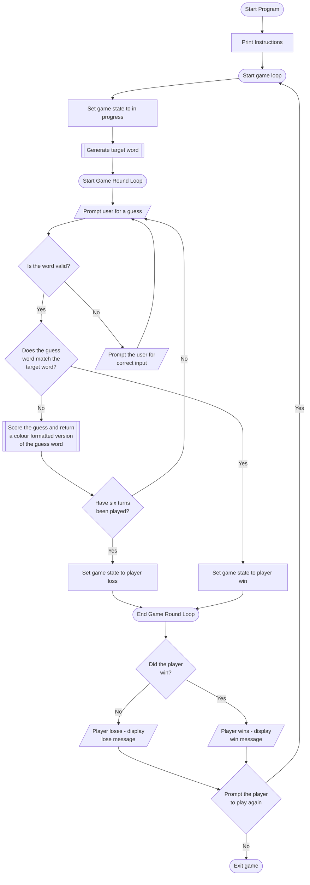
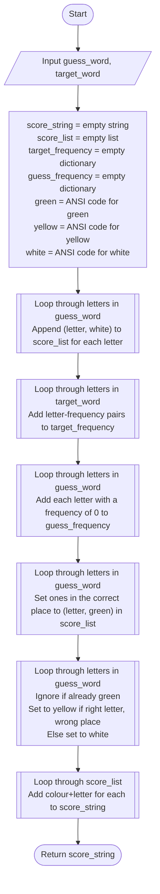

# TF23-assessment2-guessmyword
Guess My Word Assessment

## General Flow of Game / User Experience

### Flowchart



### Scoring Algorithm

#### Objective

Take an input of two strings of five letters (one being the guess and the other the target word) and compare them, then output a string of the guess word formatted according to the below rules to represent how close the guess word is to the target word.

#### Rules:
* Letters matching and in the correct place will be formatted green
* Letters matching and in the wrong place will be formatted yellow
* Letters which do not match any in the target word will be formatted white
* If there are more instances of a letter in the target word than in the guessed word, the letter(s) will be formatted yellow or green as appropriate and no other indication will be given of extra missing letters until that letter is included in a further guess
* If there are more instances of a letter in the guess word than in the target word, they will be formatted as follows:
  * Any letters in the correct place will be formatted green first
  * If there are any more of the letter in the target word but they are in the wrong place in the guessed word, they will be formatted yellow
  * If the number of formatted letters in the guess word is equal to the number of instances of that letter in the target word, any remaining instances of that letter in the guess word will be formatted as white

#### Test Cases:

#### TODO - Finish this:

|                        Test                        | Example Guess | Example Target | Result | Verdict |
|:--------------------------------------------------:|:-------------:|:--------------:|:------:| :-----: |
|     All letters the same, in the correct place     |     Hello     |     Hello      | GGGGG  | Pass    |
|      All letters the same, in the wrong place      |     Shore     |     Hoser      | YYYYY  | Pass    |
|                 All letters wrong                  |     Hello     |     Punch      | WWWWW  | Pass    |
| More instances of a letter in target than in guess |     Imply     |     Hello      | WWWGW  | Pass    |
| More instances of a letter in target than in guess |     Eased     |     Levee      | YWWGW  | Pass    |
| More instances of a letter in guess than in target |     Levee     |     Eased      | WYWGW  | Pass    |
| More instances of a letter in guess than in target |     Hello     |     Imply      | WWWGW  | Pass    |

#### Simple Flowchart



#### Pseudocode

```angular2html
score_word(guess_word, target_word):

  score_string = empty string
  score_list = empty list
  target_frequency = empty dictionary
  guess_frequency = empty dictionary
  green = "\033[0;32m" (ANSI Code for Green Text)
  yellow = "\033[0;33m" (ANSI Code for Yellow Text)
  white = "\033[0;37m" (ANSI Code for White Text)

  for each letter in guess_word:
    append a tuple of (letter, white) to score_list
  for each letter in target_word:
    create key-value pairs in target_frequency of 
    {each letter: # of occurences}
  for each letter in guess_word:
    create key-value pairs in guess_frequency of
    {each letter: 0}

  for each letter in guess_word:
    if the letter matches and is in the right place:
      set score_list at this index to (letter: green) +1 frequency of this letter in guess_frequency

  for each letter in guess_word:
    if this index in score_list is (letter, green):
      skip this letter and start next iteration
    else:
      +1 frequency of this letter in guess_frequency
    
    if letter exists in target_word AND has appeared so far <= to the amount of times in the target word:
      set score_list at this index to (letter: yellow)
    else:
      set score_list at this index to (letter: white)

  for each tuple in score_list:
    add colour+letter to score_string
  
  return score_string
```
#### In Depth Flowchart

```mermaid
flowchart TD

    A([Start]) --> B[/Input guess_word, target_word/]

    B --> C[score_string = empty string\nscore_list = empty list\ntarget_frequency = empty dictionary\nguess_frequency = empty dictionary\ngreen = ANSI code for green\nyellow = ANSI code for yellow\nwhite = ANSI code for white]

    C --> D([Begin Loop\nFor each letter in guess_word:])

    D --> E[["Append (letter, white) to score_list"]]

    E --> F{Is last letter?}

    F -->|No| D

    F -->|Yes| G([End Loop])

    G --> H([Start Loop\nfor each letter in target_word])

    H --> I{Is letter in\ntarget_frequency?}

    I -->|No| J[Add letter = 1 to target_frequency]

    I -->|Yes| K[Add 1 to letter in target_frequency]

    J --> L{Is last letter?}

    K --> L

    L -->|No| H

    L -->|Yes| M([End Loop])

    M --> N([Start Loop\nfor each letter in guess_word])

    N --> O{Is letter same\nas target_word at\nsame index?}

    O -->|Yes| P["guess_frequency[letter] += 1\nSet letter to green in score_list"]

    O -->|No| N

    P --> Q{Is last letter?}

    Q -->|No| N

    Q -->|Yes| R([End Loop])

    R --> S([Start Loop\nfor each letter in guess_word])

    S --> T{Is letter same\nas target_word at\nsame index?}

    T -->|Yes| S

    T -->|No| U["guess_frequency[letter] += 1"]

    U --> V{Is letter in target_word\nsomewhere?}

    V -->|No| W[Set letter to white in score_list]

    W --> Y{Is last letter?}

    Y -->|No| S

    V -->|Yes| Z{"Is guess_frequency[letter]\n<= target_frequency[letter]?"}

    Z -->|No| W

    Z -->|Yes| AA[Set letter to yellow in score_list]

    AA -->Y

    Y -->|Yes| AB([End Loop])

    AB --> AC([Start loop\nfor each entry in score_list])

    AC --> AD[Add colour + letter to score_string]

    AD --> AE{Is last entry?}

    AE -->|No| AC

    AE -->|Yes| AF[/Return score_string/]
```



#### Code

```angular2html
def score_word(guess_word, target_word):
    
    score_string = str()
    score_list = list()
    target_frequency = dict()
    guess_frequency = dict()
    green = "\033[0;32m"
    yellow = "\033[0;33m"
    white = "\033[0;37m"

    for letter in guess_word:
        score_list.append((letter, white))
    
    for letter in target_word:
        if letter not in target_frequency:
            target_frequency[letter] = 1
        else:
            target_frequency[letter] += 1
    
    for letter in guess_word:
        guess_frequency[letter] = 0

    for counter, letter in enumerate(guess_word):
        if letter == target_word[counter]:
            guess_frequency[letter] += 1
            score_list[counter] = (letter, green)

    for counter, letter in enumerate(guess_word):
        if score_list[counter][1] == green:
            continue
        else:
            guess_frequency[letter] += 1
        if letter in target_word and guess_frequency[letter] <= target_frequency[letter]:
            score_list[counter] = (letter, yellow)
        else:
            score_list[counter] = (letter, white)
    
    for letter in score_list:
        score_string += letter[1] + letter[0]
    
    return score_string
```
